# Compliance Assistant (Cloudflare Native)

Cloudflare-native multi-tenant AI compliance assistant for enterprise client delivery.



## Governance

Development standards and decision records for this project:
- Engineering Playbook: `docs/engineering-playbook.md`
- Architecture Decision Records (ADRs): `docs/adrs/`
- PR Checklist: `docs/checklists/pr-checklist.md`
- 30-day status board: `docs/30-day-plan-status.md`
- Runbooks: `docs/runbooks/`
- Learning module (isolated from runtime code): `learning/README.md`

## Goal

Ship a working system that can:
- ingest compliance documents,
- answer questions with grounded citations,
- isolate tenant data,
- support enterprise IAM/SSO,
- expose reliability/cost/security metrics,
- and run as a Cloudflare-native deployment.

## Cloudflare Service Map

Use these services as the default architecture:
- Compute/API: `Cloudflare Workers`
- Frontend/dashboard: `Next.js` admin app hosted on `Cloudflare Pages`
- Document storage: `R2`
- Vector search: `Vectorize`
- Relational metadata: `D1`
- Cache/config/session hints: `KV`
- Queue/async ingestion: `Queues`
- Rate limits/coordination: `Durable Objects`
- Observability: Workers logs + analytics pipeline
- Edge security and identity gate: `Cloudflare Access` (OIDC/SAML IdP)

## Scope

### In scope
- Multi-tenant RAG API on Workers
- Document ingest + chunk + embed + index pipeline
- `/query` answer flow with citations
- Enterprise IAM/SSO (OIDC + SAML) and RBAC mapping
- Usage/cost/latency metrics
- Reliability controls (timeouts/retries/fallback)
- Guardrails and prompt-injection defense
- Admin dashboard (Next.js on Cloudflare Pages)
- Deployment and runbook docs

### Out of current scope
- Multi-region active-active architecture
- SOC2 audit package and formal certification
- Full enterprise SCIM automation beyond a documented implementation path

## Current Implementation Snapshot

```txt
apps/
  admin-pages/
    app/
      globals.css
      layout.jsx
      page.jsx
    next.config.mjs
    wrangler.toml
  api/
    src/
      server.ts
  api-worker/
    src/
      index.ts
    wrangler.toml
  ingest-worker/
    src/
      index.ts
    wrangler.toml
  queue-consumer/
    src/
      index.ts
    wrangler.toml

packages/
  ai/
    llm.ts
    search.ts
  shared/
    src/
      index.ts
```

## Target Wrangler Project Layout

```txt
apps/
  api-worker/
    src/
      index.ts
      routes/
        health.ts
        query.ts
        ingest.ts
        metrics.ts
      lib/
        auth/
        rbac/
        retrieval/
        orchestration/
        guardrails/
        observability/
        tenants/
        cost/
      bindings.ts
      types.ts
    wrangler.toml

  ingest-worker/
    src/
      index.ts
      processors/
        parse.ts
        chunk.ts
        embed.ts
        index.ts
    wrangler.toml

  queue-consumer/
    src/index.ts
    wrangler.toml

  admin-pages/
    app/
      layout.jsx
      page.jsx
      globals.css
    next.config.mjs
    wrangler.toml

packages/
  shared/
    src/
      schemas/
      prompts/
      eval/

infra/
  wrangler/
    base.toml
    environments/
      dev.toml
      staging.toml
      prod.toml
  diagrams/

docs/
  architecture.md
  cloudflare-resources.md
  cloudflare-secrets.md
  engineering-playbook.md
  30-day-plan-status.md
  adrs/
  checklists/
  runbooks/

evals/
  dataset.jsonl        # planned
  runner.ts            # planned
  scoring.ts           # planned

tests/
  unit/
  integration/
  e2e/
```

## Environment and Bindings Standard

Each Worker uses explicit bindings in `wrangler.toml`:
- `R2_BUCKET` for source docs and ingest artifacts
- `VECTORIZE_INDEX` for embeddings
- `DB` (`D1`) for tenant, user, request, and audit metadata
- `CACHE_KV` (`KV`) for fast cache keys and feature flags
- `INGEST_QUEUE` for async ingestion jobs
- `RATE_LIMITER_DO` durable object namespace
- Secrets for model provider and signing keys

Use three environments:
- `dev`
- `staging`
- `prod`

## Initial Commands

```bash
pnpm install
pnpm dlx wrangler whoami
pnpm --filter @apps/api-worker dev
API_WORKER_URL=http://127.0.0.1:8787 pnpm run dev:admin
```
