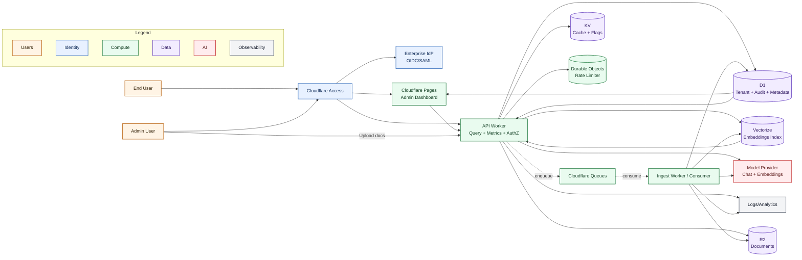

# System Architecture

This document defines the Cloudflare-native system architecture for the Compliance Assistant platform.

## Overview

The system is designed around:
- edge API execution on Cloudflare Workers,
- asynchronous ingestion with Queues,
- tenant-aware retrieval using Vectorize,
- enterprise access control via Cloudflare Access (OIDC/SAML),
- operational telemetry and audit events in D1/log streams.

## Architecture Diagram



## Request Flow (Query)

1. User authenticates via Cloudflare Access (backed by OIDC/SAML IdP).
2. API Worker validates tenant + role and applies rate limiting via Durable Objects.
3. API Worker checks KV cache, then performs retrieval against Vectorize.
4. API Worker calls the model provider with grounded context.
5. API Worker returns answer + citations and emits metrics/audit events.

## Ingestion Flow

1. Admin uploads source documents through API.
2. API writes file/object metadata to R2 and D1.
3. API enqueues ingestion task to Cloudflare Queues.
4. Ingest worker chunks documents, generates embeddings, and updates Vectorize.
5. Ingest worker records status and audit trails in D1.

## API Contracts

All endpoints are tenant-scoped and require authenticated identity context from Cloudflare Access headers.

### POST /query

Purpose:
- ask a grounded question against tenant documents.

Request:

```json
{
  "tenantId": "tenant_abc",
  "question": "What controls apply to vendor access?",
  "topK": 5,
  "filters": {
    "tags": ["access-control"],
    "sources": ["policy-handbook-2026.pdf"]
  },
  "conversationId": "conv_123"
}
```

Response:

```json
{
  "requestId": "req_01HXYZ",
  "tenantId": "tenant_abc",
  "answer": "Vendor access requires ...",
  "citations": [
    {
      "sourceId": "doc_42",
      "chunkId": "chunk_0042",
      "title": "Policy Handbook 2026",
      "score": 0.91
    }
  ],
  "usage": {
    "promptTokens": 1180,
    "completionTokens": 220,
    "estimatedCostUsd": 0.0112
  },
  "latencyMs": 1830
}
```

Errors:
- `400` invalid schema
- `401` unauthenticated
- `403` unauthorized role/tenant mismatch
- `429` throttled
- `500` model/retrieval internal failure

### POST /ingest

Purpose:
- register a tenant document for async ingestion/indexing.

Request:

```json
{
  "tenantId": "tenant_abc",
  "document": {
    "sourceType": "r2",
    "objectKey": "tenant_abc/policies/policy-handbook-2026.pdf",
    "title": "Policy Handbook 2026",
    "tags": ["policy", "access-control"]
  },
  "idempotencyKey": "ingest-policy-handbook-2026-v1"
}
```

Response:

```json
{
  "requestId": "req_01HXYZ",
  "tenantId": "tenant_abc",
  "jobId": "job_987",
  "status": "queued"
}
```

Errors:
- `400` invalid schema
- `401` unauthenticated
- `403` unauthorized (non-admin role)
- `409` duplicate idempotency key
- `500` queue/storage failure

### GET /metrics

Purpose:
- retrieve operational metrics for tenant or admin scope.

Query params:
- `tenantId` (required for tenant admins; optional for platform admins)
- `from` / `to` (ISO timestamp range)
- `granularity` (`5m` | `1h` | `1d`)

Response:

```json
{
  "requestId": "req_01HXYZ",
  "scope": {
    "tenantId": "tenant_abc",
    "from": "2026-02-01T00:00:00Z",
    "to": "2026-02-02T00:00:00Z",
    "granularity": "1h"
  },
  "metrics": {
    "requests": 3200,
    "successRate": 0.993,
    "p50LatencyMs": 1240,
    "p95LatencyMs": 3880,
    "promptTokens": 820000,
    "completionTokens": 145000,
    "estimatedCostUsd": 64.23,
    "cacheHitRate": 0.37,
    "throttleEvents": 14
  }
}
```

Errors:
- `400` invalid query params
- `401` unauthenticated
- `403` unauthorized scope

## Tenant and RBAC Model

### Tenant Isolation Model

- Every request resolves `tenantId` from trusted identity context and validates it against request scope.
- Data is partitioned by `tenantId` in all storage paths:
  - R2 object keys: `tenantId/...`
  - Vectorize metadata: `tenantId` filter required on retrieval
  - D1 tables: tenant foreign key on all tenant-owned records
  - KV cache keys: prefixed by `tenantId`
- Cross-tenant access is always denied, even for valid users without platform-admin role.

### Identity Claims Mapping

Identity is established by Cloudflare Access and mapped to an internal auth context:

- `sub` -> `userId`
- `email` -> `userEmail`
- `groups` / custom role claim -> candidate app roles
- `tenant_id` claim (or Access policy mapping) -> allowed tenant scope

Derived request auth context:

```json
{
  "userId": "usr_123",
  "email": "analyst@clientco.com",
  "tenantId": "tenant_abc",
  "roles": ["tenant_analyst"]
}
```

### Roles

- `platform_admin`
  - manage all tenants, global metrics, and system operations.
- `tenant_admin`
  - manage documents/ingestion and tenant metrics for their own tenant.
- `tenant_analyst`
  - run queries and view tenant metrics.
- `tenant_viewer`
  - read-only access to query results and limited metrics.
- `service_account`
  - machine identity for ingestion/automation with scoped permissions.

### Permission Matrix

| Action | platform_admin | tenant_admin | tenant_analyst | tenant_viewer | service_account |
|---|---|---|---|---|---|
| Query documents (`POST /query`) | allow | allow | allow | allow | allow (scoped) |
| Register ingestion (`POST /ingest`) | allow | allow | deny | deny | allow (scoped) |
| View tenant metrics (`GET /metrics?tenantId=`) | allow | allow | allow | allow (limited fields) | allow (scoped) |
| View global/platform metrics | allow | deny | deny | deny | deny |
| Manage tenant role bindings | allow | allow (own tenant) | deny | deny | deny |

### Endpoint Authorization Rules

- `POST /query`
  - requires one of: `platform_admin`, `tenant_admin`, `tenant_analyst`, `tenant_viewer`, `service_account`
  - request `tenantId` must match allowed tenant scope unless `platform_admin`
- `POST /ingest`
  - requires one of: `platform_admin`, `tenant_admin`, `service_account`
  - ingestion writes only into scoped tenant storage paths
- `GET /metrics`
  - tenant scope: all tenant roles allowed, `tenant_viewer` receives limited fields
  - global scope: `platform_admin` only

### Authorization Decision Trace (for auditability)

Every protected request logs:

```json
{
  "requestId": "req_01HXYZ",
  "userId": "usr_123",
  "tenantId": "tenant_abc",
  "roles": ["tenant_analyst"],
  "action": "query.execute",
  "resource": "tenant:tenant_abc",
  "decision": "allow",
  "reason": "role_match_and_scope_match"
}
```
