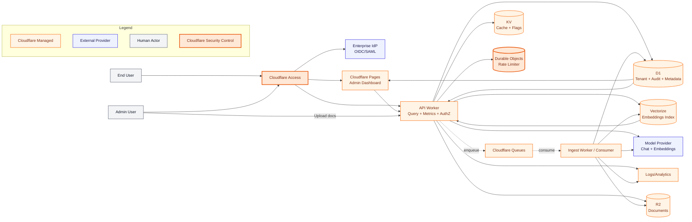

# System Architecture

This document defines the Cloudflare-native system architecture for the Compliance Assistant platform.

## Overview

The system is designed around:
- edge API execution on Cloudflare Workers,
- asynchronous ingestion with Queues,
- tenant-aware retrieval using Vectorize,
- enterprise access control via Cloudflare Access (OIDC/SAML),
- operational telemetry and audit events in D1/log streams.

## Architecture Diagram

## Request Flow (Query)

1. User authenticates via Cloudflare Access (backed by OIDC/SAML IdP).
2. API Worker validates tenant + role and applies rate limiting via Durable Objects.
3. API Worker checks KV cache, then performs retrieval against Vectorize.
4. API Worker calls the model provider with grounded context.
5. API Worker returns answer + citations and emits metrics/audit events.

## Ingestion Flow

1. Admin uploads source documents through API.
2. API writes file/object metadata to R2 and D1.
3. API enqueues ingestion task to Cloudflare Queues.
4. Ingest worker chunks documents, generates embeddings, and updates Vectorize.
5. Ingest worker records status and audit trails in D1.
