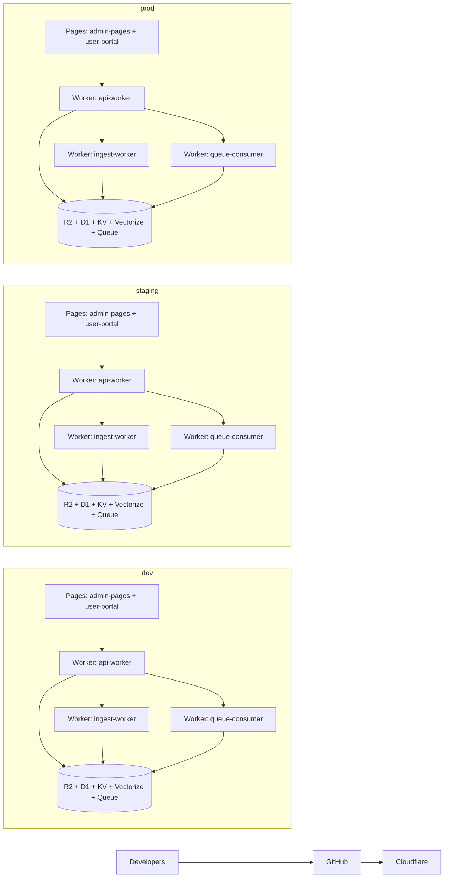

# Deployment Topology

Last updated: February 17, 2026

## Environment Layout

## Control Points

- Tenant isolation is enforced in request contracts and storage keying (`tenantId` scope).
- Runtime infrastructure IDs are tracked in `docs/cloudflare-resources.md`.
- Secret management commands are tracked in `docs/cloudflare-secrets.md`.
- API edge routes should validate external input with zod schemas at boundaries.
